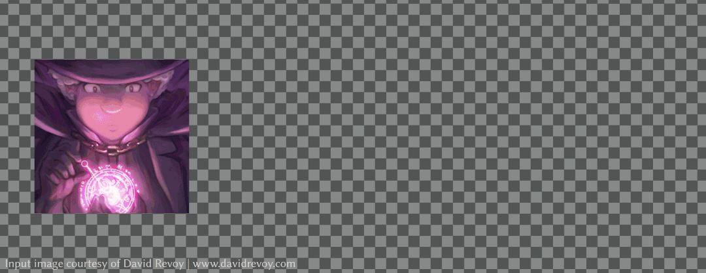
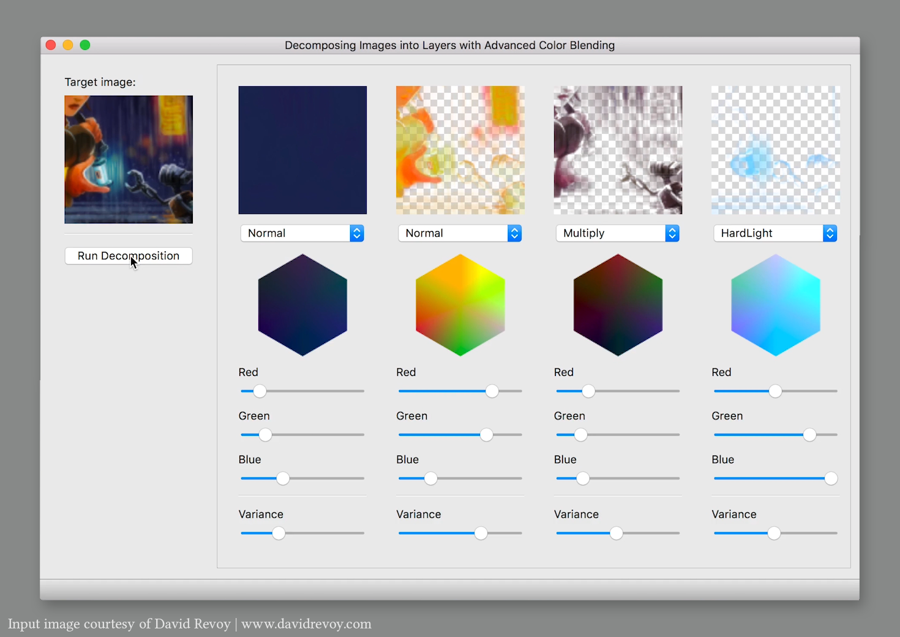

# Unblending

Unblending is a C++ library for decomposing a target image into a set of semi-transparent layers associated with *advanced color-blend modes* (e.g., "multiply" and "color-dodge"). Output layers can be imported to Adobe Photoshop, Adobe After Effects, GIMP, Krita, etc. and are useful for performing complex edits that are otherwise difficult.



- `unblending` is a library that provides the main functionality for the use from other programs.
- `unblending-cli` is an executable with a command line interface to use the main functionality.
- `unblending-gui` is an executable with a graphical user interface to use the main functionality with interactive specification of necessary input parameters.

## Publication

Yuki Koyama and Masataka Goto. 2018. Decomposing Images into Layers with Advanced Color Blending. Comput. Graph. Forum 37, 7, pp.397--407 (2018). (a.k.a. Proceedings of Pacific Graphics 2018) DOI: <https://doi.org/10.1111/cgf.13577>

This library is provided mainly for researchers who want to use or extend the method described in the above paper. We also expect that this library is useful for developers who plan to use the method in their software.

## Demo

Unblending Web App: <https://unblending.ongaaccel.jp>

## Dependencies

- cxxopts <https://github.com/jarro2783/cxxopts> (included as gitsubmodule)
- json11 <https://github.com/dropbox/json11> (included as gitsubmodule)
- NLopt <https://nlopt.readthedocs.io/> (included as gitsubmodule)
- nlopt-util <https://github.com/yuki-koyama/nlopt-util> (included as gitsubmodule)
- parallel-util <https://github.com/yuki-koyama/parallel-util> (included as gitsubmodule)
- timer <https://github.com/yuki-koyama/timer> (included as gitsubmodule)
- tinycolormap <https://github.com/yuki-koyama/tinycolormap> (included as gitsubmodule)
- Eigen <http://eigen.tuxfamily.org/>
- Qt <https://www.qt.io/>

## Prerequisites

Eigen (3.x.x) and Qt (5.x.x) need to be installed beforehand.

### macOS

```
$ brew install eigen qt5
```

### Ubuntu

```
$ sudo apt install qt5-default libeigen3-dev
```

## Build Using CMake

Unblending is organized using `cmake` and is built by the following commands:
```
$ git clone https://github.com/yuki-koyama/unblending.git --recursive
$ mkdir build
$ cd build
$ cmake ../unblending
$ make
```
This process builds a static library (e.g., `libunblending.a`) and a command line interface (CLI) named `unblending-cli`.

The CLI can be used by the following command:
```
$ ./unblending-cli/unblending-cli [-o <output-dir-path>] [-w <target-image-width>] <input-image-path> <layer-infos-path>
```

The GUI allows you to interactively specify necessary parameters. Currently the GUI is tested on macOS only (pull requests are highly appreciated).



## Build and Run Using Docker

If you use `docker`, you can easily build the CLI by `docker build`:
```
$ git clone https://github.com/yuki-koyama/unblending.git --recursive
$ cd unblending
$ docker build -t unblending-cli:latest .
```

Then, you can use the CLI by `docker run`:
```
$ docker run --rm --volume $(pwd):/tmp -it unblending-cli:latest [-o <output-dir-path>] [-w <target-image-width>] <input-image-path> <layer-infos-path>
```

For example, the following command generates results into a sub directory named `output`:
```
$ docker run --rm --volume $(pwd):/tmp -it unblending-cli:latest -o /tmp/output -w 120 /tmp/examples/magic.png /tmp/examples/magic.json
```
Note: this typically takes around 10--30 seconds with consumer-level laptops.

## `LayerInfos` File Structure

See `LayerInfos.md`.

## Licensing

Unblending is dual-licensed; You may use this software under either *LGPLv3* or *our commercial (proprietary) license*. See the `LICENSE` files for details.

## Contributing

Pull requests are highly welcome. Please be aware that any contribution to this repository will be licensed under the above license condition.

## Authors

- Yuki Koyama
- Masataka Goto

## Copyright

Copyright (c) 2018 National Institute of Advanced Industrial Science and Technology (AIST) - <koyama.y@aist.go.jp>
